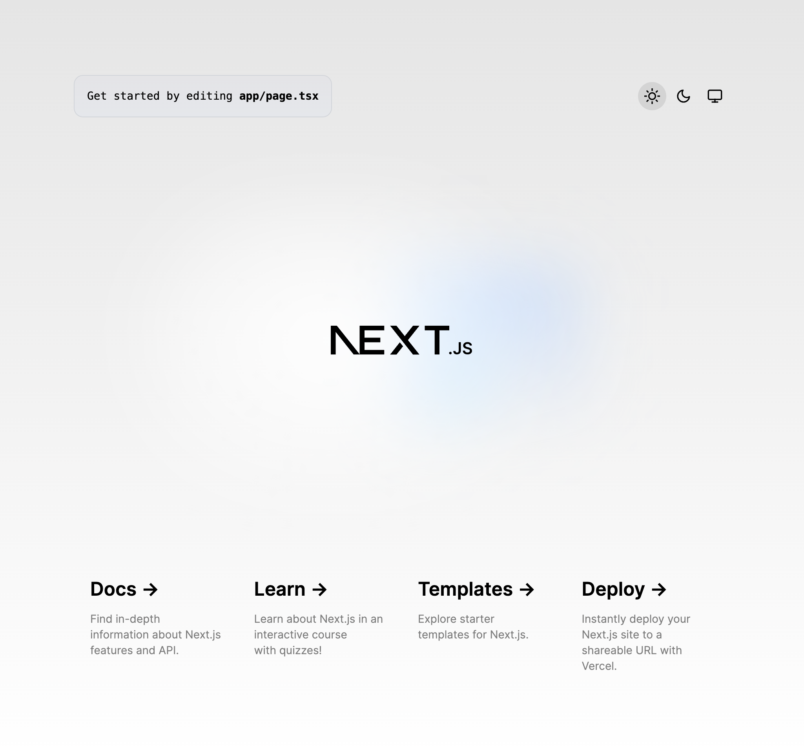
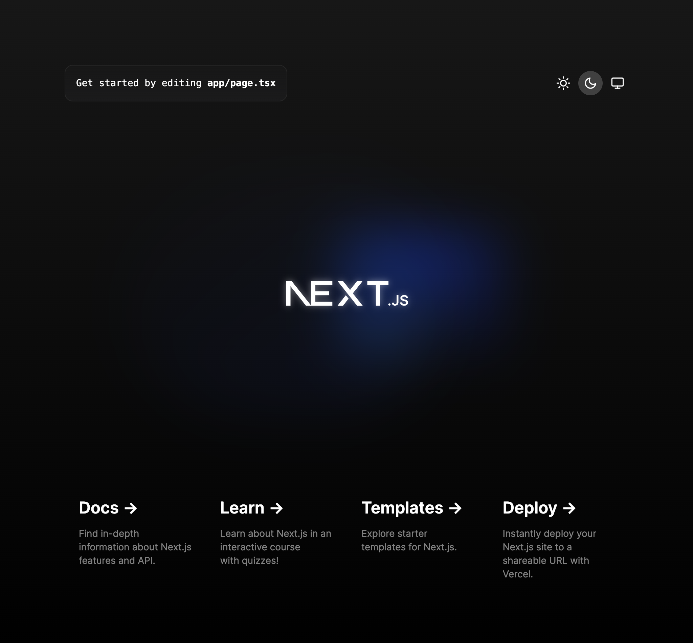

This is the official [NextJS](https://nextjs.org/) boilerplate, bootstrapped with [Next-Themes](https://github.com/pacocoursey/next-themes) and [Tailwind](https://github.com/tailwindlabs/tailwindcss)

It supports light, dark and system color schemes





## Getting Started

First, clone the repository
```bash
git clone https://github.com/markhorn-dev/nextjs-themes-boilerplate.git
```

Change directory
```bash
cd nextjs-themes-boilerplate
```

Optionally, open in vscode
```bash
code .
```

Install dependencies
```bash
npm install
# or
yarn install
# or
pnpm install
```

Finally, run the dev server
```bash
npm run dev
# or
yarn dev
# or
pnpm dev
```

Open localhost on whatever port you are running on. 

Example: [http://localhost:3000](http://localhost:3000)
